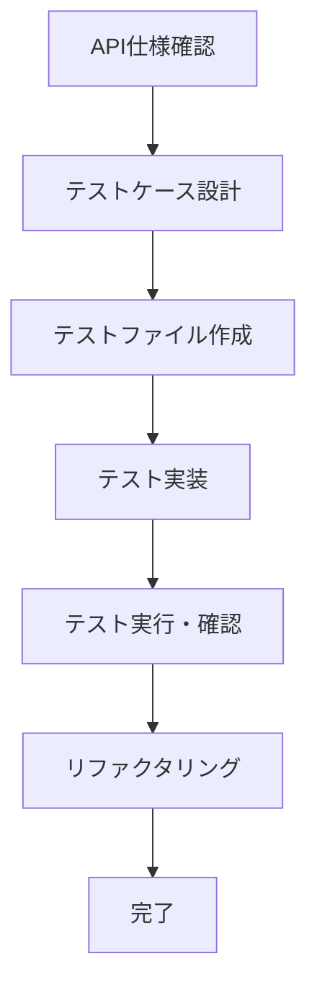

# API自動統合テスト開発ガイド

MycaLinks POS SystemのAPI統合テストを効率的に開発するための実践ガイドです。

## 📋 前提条件

- [API統合テスト環境セットアップガイド](./API統合テスト環境セットアップガイド.md) の完了
- 基本的なTypeScriptの知識
- REST APIの基本的な理解

## 🎯 1. テスト開発の基本フロー

### 1.1 開発手順


### 1.2 ファイル配置ルール
```
packages/web-app/src/app/api/
├── store/[store_id]/product/
│   ├── route.ts          # API実装
│   └── route.test.ts     # テストファイル
└── corporation/
    ├── route.ts
    └── route.test.ts
```

**ルール**: APIルートファイル（`route.ts`）と同じディレクトリに `route.test.ts` を配置

## 🔧 2. 基本的なテスト実装

### 2.1 テストファイルの基本構造
```typescript
// packages/web-app/src/app/api/store/[store_id]/product/route.test.ts
import { describe, it, expect } from 'vitest';
import { testApiHandler } from 'next-test-api-route-handler';
import { BackendApiTest } from '@/api/backendApi/test/main';
import { apiRole } from '@/api/backendApi/main';
import { apiTestConstant } from '@/api/backendApi/test/constant';
import { GET, POST } from './route';

describe('商品API', () => {
  describe('GET /api/store/[store_id]/product', () => {
    it('商品一覧を取得できる', async () => {
      const params = {
        store_id: String(apiTestConstant.storeMock.id),
      };

      await testApiHandler({
        appHandler: { GET },
        params,
        test: BackendApiTest.define(
          {
            as: apiRole.pos, // POSユーザーとして実行
          },
          async (fetch) => {
            const response = await fetch();
            
            expect(response.status).toBe(200);
            const data = await response.json();
            expect(Array.isArray(data)).toBe(true);
          },
        ),
      });
    });
  });

  describe('POST /api/store/[store_id]/product', () => {
    it('新規商品を作成できる', async () => {
      const params = {
        store_id: String(apiTestConstant.storeMock.id),
      };

      const newProduct = {
        name: 'テスト商品',
        price: 1000,
        category_id: 1,
      };

      await testApiHandler({
        appHandler: { POST },
        params,
        test: BackendApiTest.define(
          {
            as: apiRole.pos,
          },
          async (fetch) => {
            const response = await fetch({
              method: 'POST',
              headers: { 'Content-Type': 'application/json' },
              body: JSON.stringify(newProduct),
            });

            expect(response.status).toBe(201);
            const data = await response.json();
            expect(data.name).toBe(newProduct.name);
            expect(data.price).toBe(newProduct.price);
          },
        ),
      });
    });
  });
});
```

### 2.2 認証ロールの使い分け
```typescript
// 利用可能な認証ロール
import { apiRole } from '@/api/backendApi/main';

// testApiHandler内でのロール指定
await testApiHandler({
  appHandler: { GET },
  params: { store_id: String(apiTestConstant.storeMock.id) },
  test: BackendApiTest.define(
    {
      // POSシステムユーザー（店舗スタッフ）
      as: apiRole.pos,
    },
    async (fetch) => {
      // 店舗操作のテスト
    },
  ),
});

// Mycaアプリユーザー（顧客）
await testApiHandler({
  appHandler: { GET },
  params: { store_id: String(apiTestConstant.storeMock.id) },
  test: BackendApiTest.define(
    {
      as: apiRole.myca_user,
    },
    async (fetch) => {
      // 顧客向け機能のテスト
    },
  ),
});

// 管理者
await testApiHandler({
  appHandler: { GET },
  params: { store_id: String(apiTestConstant.storeMock.id) },
  test: BackendApiTest.define(
    {
      as: apiRole.admin,
    },
    async (fetch) => {
      // 管理機能のテスト
    },
  ),
});

// 認証なし
await testApiHandler({
  appHandler: { GET },
  params: { store_id: String(apiTestConstant.storeMock.id) },
  test: BackendApiTest.define(
    {
      as: "",
    },
    async (fetch) => {
      // パブリックAPIのテスト
    },
  ),
});
```

### 2.3 テスト用固定データの活用
```typescript
import { apiTestConstant } from '@/api/backendApi/test/constant';

// 既存の固定データを使用
const storeId = apiTestConstant.storeMock.id;           // 3
const productId = apiTestConstant.productMock.id;       // 561417
const customerId = apiTestConstant.customerMock.id;     // 53
const corporationId = apiTestConstant.corporationMock.id; // 2

// testApiHandler内での使用例
await testApiHandler({
  appHandler: { GET },
  params: {
    store_id: String(storeId),
    product_id: String(productId),
  },
  test: BackendApiTest.define(
    {
      as: apiRole.pos,
    },
    async (fetch) => {
      const response = await fetch();
      expect(response.status).toBe(200);
    },
  ),
});
```

## 🧪 3. 高度なテスト実装パターン

### 3.1 エラーケースのテスト
```typescript
describe('エラーハンドリング', () => {
  it('存在しない商品IDで404エラーを返す', async () => {
    const params = {
      store_id: String(apiTestConstant.storeMock.id),
      product_id: '999999',
    };

    await testApiHandler({
      appHandler: { GET },
      params,
      test: BackendApiTest.define(
        {
          as: apiRole.pos,
        },
        async (fetch) => {
          const response = await fetch();
          
          expect(response.status).toBe(404);
          const error = await response.json();
          expect(error.message).toContain('商品が見つかりません');
        },
      ),
    });
  });

  it('権限がない場合403エラーを返す', async () => {
    const params = {
      store_id: String(apiTestConstant.storeMock.id),
    };

    await testApiHandler({
      appHandler: { POST },
      params,
      test: BackendApiTest.define(
        {
          as: "",
        },
        async (fetch) => {
          const response = await fetch({
            method: 'POST',
            headers: { 'Content-Type': 'application/json' },
            body: JSON.stringify({}),
          });
          
          expect(response.status).toBe(403);
        },
      ),
    });
  });
});
```

### 3.2 バリデーションテスト
```typescript
describe('バリデーション', () => {
  it('必須フィールドが不足している場合400エラーを返す', async () => {
    await BackendApiTest.define({ as: apiRole.pos }, async (fetch) => {
      const invalidData = {
        // name が不足
        price: 1000,
      };

      const response = await fetch(
        `/api/store/${apiTestConstant.storeMock.id}/product`,
        {
          method: 'POST',
          headers: { 'Content-Type': 'application/json' },
          body: JSON.stringify(invalidData),
        }
      );

      expect(response.status).toBe(400);
      const error = await response.json();
      expect(error.message).toContain('name');
    });
  });
});
```

### 3.3 複合操作のテスト
```typescript
describe('取引処理', () => {
  it('商品購入から在庫減少まで正常に処理される', async () => {
    await BackendApiTest.define({ as: apiRole.pos }, async (fetch) => {
      // 1. 初期在庫確認
      const initialStock = await fetch(
        `/api/store/${apiTestConstant.storeMock.id}/product/${apiTestConstant.productMock.id}/stock`
      );
      const initialData = await initialStock.json();

      // 2. 取引作成
      const transaction = await fetch(
        `/api/store/${apiTestConstant.storeMock.id}/transaction`,
        {
          method: 'POST',
          headers: { 'Content-Type': 'application/json' },
          body: JSON.stringify({
            items: [{
              product_id: apiTestConstant.productMock.id,
              quantity: 1,
              price: 1000,
            }],
            customer_id: apiTestConstant.customerMock.id,
          }),
        }
      );
      
      expect(transaction.status).toBe(201);

      // 3. 在庫減少確認
      const updatedStock = await fetch(
        `/api/store/${apiTestConstant.storeMock.id}/product/${apiTestConstant.productMock.id}/stock`
      );
      const updatedData = await updatedStock.json();
      
      expect(updatedData.quantity).toBe(initialData.quantity - 1);
    });
  });
});
```

## 🔍 4. テスト実行とデバッグ

### 4.1 個別テスト実行
```bash
# 特定のテストファイルのみ実行
cd packages/web-app
pnpm run test:integ:api:internal -- src/app/api/store/[store_id]/product/route.test.ts

# 特定のテストケースのみ実行
pnpm run test:integ:api:internal -- --grep "商品一覧を取得"

# ウォッチモードで実行（ファイル変更時に自動実行）
pnpm run test:integ:api:internal -- --watch
```

### 4.2 デバッグ出力
```typescript
describe('デバッグ例', () => {
  it('レスポンス内容を確認', async () => {
    await BackendApiTest.define({ as: apiRole.pos }, async (fetch) => {
      const response = await fetch('/api/store/3/product');
      const data = await response.json();
      
      // デバッグ出力
      console.log('Response status:', response.status);
      console.log('Response data:', JSON.stringify(data, null, 2));
      
      expect(response.status).toBe(200);
    });
  });
});
```

### 4.3 エラー時の調査方法
```bash
# 開発サーバーのログを確認
cd packages/web-app
pnpm run dev  # 別ターミナルで起動

# テスト実行時のエラーログを詳細表示
pnpm run test:integ:api:internal -- --reporter=verbose
```

## 📊 5. テストの品質向上

### 5.1 テストの命名規則
```typescript
describe('APIエンドポイント名', () => {
  describe('HTTPメソッド /api/path', () => {
    it('正常系: 期待される動作を説明', async () => {
      // テスト実装
    });
    
    it('異常系: エラー条件を説明', async () => {
      // エラーテスト実装
    });
  });
});
```

### 5.2 テストデータの管理
```typescript
// テストデータを定数として定義
const TEST_PRODUCT_DATA = {
  valid: {
    name: 'テスト商品',
    price: 1000,
    category_id: 1,
  },
  invalid: {
    name: '', // 空文字
    price: -100, // 負の値
  },
};

// テストで使用
const response = await fetch('/api/product', {
  method: 'POST',
  body: JSON.stringify(TEST_PRODUCT_DATA.valid),
});
```

### 5.3 アサーションの充実
```typescript
it('商品作成レスポンスの詳細検証', async () => {
  await BackendApiTest.define({ as: apiRole.pos }, async (fetch) => {
    const response = await fetch('/api/store/3/product', {
      method: 'POST',
      body: JSON.stringify({
        name: 'テスト商品',
        price: 1000,
        category_id: 1,
      }),
    });

    // ステータスコード検証
    expect(response.status).toBe(201);
    
    // レスポンスヘッダー検証
    expect(response.headers.get('content-type')).toContain('application/json');
    
    // レスポンスボディ検証
    const data = await response.json();
    expect(data).toMatchObject({
      id: expect.any(Number),
      name: 'テスト商品',
      price: 1000,
      category_id: 1,
      created_at: expect.any(String),
      updated_at: expect.any(String),
    });
    
    // 日付フォーマット検証
    expect(new Date(data.created_at).toISOString()).toBe(data.created_at);
  });
});
```

## 🚀 6. 効率的な開発のコツ

### 6.1 テスト駆動開発（TDD）
```typescript
// 1. まずテストを書く（失敗する）
it('新機能: 商品の在庫アラート設定', async () => {
  await BackendApiTest.define({ as: apiRole.pos }, async (fetch) => {
    const response = await fetch('/api/store/3/product/1/alert', {
      method: 'POST',
      body: JSON.stringify({ threshold: 10 }),
    });
    
    expect(response.status).toBe(201);
  });
});

// 2. 最小限の実装でテストを通す
// 3. リファクタリング
```

### 6.2 共通テストヘルパーの活用
```typescript
// packages/web-app/src/api/backendApi/test/helpers.ts
export const TestHelpers = {
  async createTestProduct(fetch: any, storeId: number) {
    const response = await fetch(`/api/store/${storeId}/product`, {
      method: 'POST',
      body: JSON.stringify({
        name: `テスト商品_${Date.now()}`,
        price: 1000,
        category_id: 1,
      }),
    });
    return response.json();
  },

  async deleteTestProduct(fetch: any, storeId: number, productId: number) {
    return fetch(`/api/store/${storeId}/product/${productId}`, {
      method: 'DELETE',
    });
  },
};

// テストで使用
it('商品削除テスト', async () => {
  await BackendApiTest.define({ as: apiRole.pos }, async (fetch) => {
    // テストデータ作成
    const product = await TestHelpers.createTestProduct(fetch, 3);
    
    // 削除実行
    const response = await TestHelpers.deleteTestProduct(fetch, 3, product.id);
    expect(response.status).toBe(204);
  });
});
```

## 📋 7. チェックリスト

### 7.1 テスト実装チェックリスト
- [ ] 正常系のテストケースを実装
- [ ] 主要なエラーケースを実装
- [ ] バリデーションテストを実装
- [ ] 適切な認証ロールを使用
- [ ] レスポンス形式を詳細に検証
- [ ] テスト名が分かりやすい
- [ ] テストが独立して実行可能

### 7.2 コードレビューチェックリスト
- [ ] テストの意図が明確
- [ ] 適切なアサーションを使用
- [ ] テストデータが適切
- [ ] エラーハンドリングが適切
- [ ] パフォーマンスに問題なし

## 🎯 8. 次のステップ

このガイドでAPI統合テストの基本を習得したら、以下に進むことができます：

- [テストケーステンプレート集](./テストケーステンプレート集.md) - 実際の実装パターンに基づく再利用可能なテンプレート
- [テスト実行・監視ガイド](./テスト実行・監視ガイド.md) - CI/CD環境での運用
- [APIエンドポイント仕様書](./APIエンドポイント仕様書.md) - 全APIの詳細仕様

---

**重要**: このガイドは実際の既存実装（59個のテストファイル、135個のテストケース）に基づいて作成されています。実際に動作する環境で学習・開発を進めることができます。 