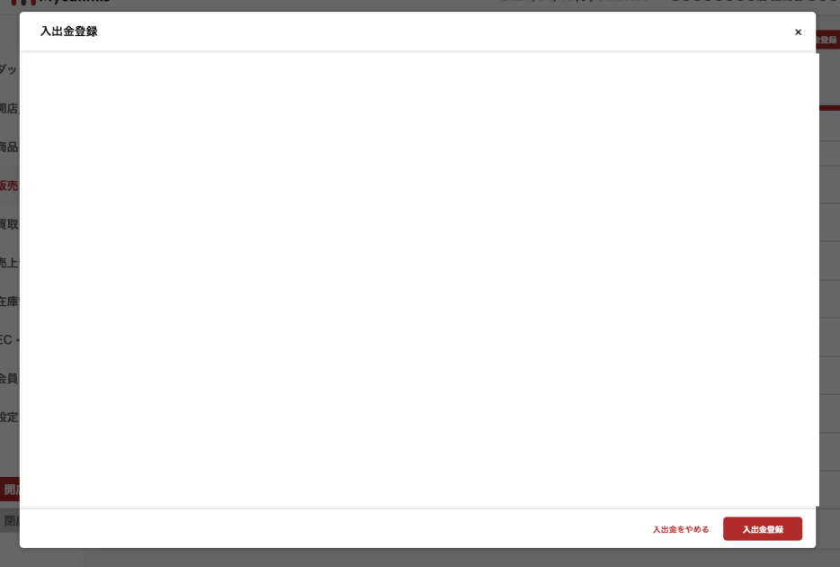
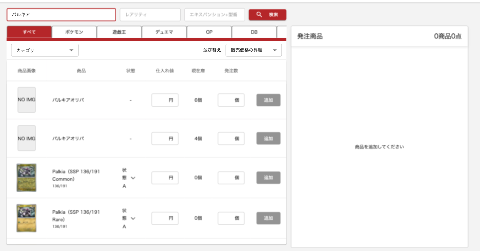
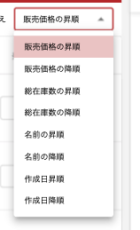

# コンポーネント一覧

| 名前                           | パス                                                           | 画像                                                           | 概要                                                                                                   |
| ------------------------------ | -------------------------------------------------------------- | -------------------------------------------------------------- | ------------------------------------------------------------------------------------------------------ |
| `ContainerLayout`              | `src\components\layouts\ContainerLayout.tsx`                   |                         | ページのひな形を構成                                                                                   |
| `CustomTab`                    | `src\components\tabs\CustomTab.tsx`                            |                               | 中身をheader,content,footerと自由に渡せるタブ                                                          |
| `CustomTabTable`               | `src\components\tabs\CustomTabTable.tsx`                       |                          | 中身がheader,リスト,footerのタブデザイン                                                               |
| `CustomTable`                  | `src\components\tables\CustomTable.tsx`                        |                             | テーブルコンポーネント                                                                                 |
| `PrimaryButtonWithIcon`        | `@/components/buttons/PrimaryButtonWithIcon`                   | 　　　　          | 基本的にこのボタン　※後々名称変更予定                                                                  |
| `SecondaryButtonWithIcon`      | `@/components/buttons/SecondaryButtonWithIcon`                 | 　　　　        | ※後々名称変更予定                                                                                      |
| `TertiaryButtonWithIcon`       | `@/components/buttons/TertiaryButtonWithIcon`                  | 　　　　         | ※後々名称変更予定                                                                                      |
| `SimpleButtonWithIcon`         | `@/components/buttons/SimpleButtonWithIcon`　　　　            | 　　　　           |                                                                                                        |
| `DetailCard`                   | `@/components/cards/DetailCard`　　　　                        | 　　　　                     | 詳細系で使用　※必要があればアップデートしてください                                                    |
| `CustomModalWithIcon`          | `@/components/modals/CustomModalWithIcon`　　　　              | 　　　              | 基本モーダルはこれ                                                                                     |
| `StyledAlertConfirmationModal` | `@/components/modals/StyledAlertConfirmationModal`　　　　     | 　　　　   |                                                                                                        |
| `ConfirmationDialog`           | `@components/dialogs/ConfirmationDialog`　　　　               | 　　　　             |                                                                                                        |
| `NumericTextField`             | `@/components/inputFields/NumericTextField`　　　　            | 　　　　     | 数値入力フィールド　                                                                                   |
| `ItemImage`                    | `src\feature\item\components\ItemImage.tsx`                    | 　　　　                      | tooltip付き画像                                                                                        |
| `ItemText`                     | `src\feature\item\components\ItemText.tsx`                     | 　　　　                                                       | tooltip付き文字列                                                                                      |
| `GenreTab`                     | `@/feature/item/components/tab/GenreTab`　　　　               | 　　　　                   | ジャンルの選択のタブ、現状ItemSearchStateを渡す実装で想定しているがProductも渡せるようにするべきかも　 |
| `ItemSearch`                   | `@\feature\item\components\search\ItemSearch.tsx`              | 　　　　                   | 商品検索で使用　                                                                                       |
| `ProductSearch`                | `@components\ProductSearch.tsx`                                | 　　                                                           | 在庫（product）検索で使用　                                                                            |
| `InfoTooltip`                  | `@/components/tooltips/InfoTooltip`　　　　                    | 　　　　                    | ！をクリックしたら開くtooltip                                                                          |
| `ProductCountSearchHeader`     | `src\feature\products\components\ProductCountSearchHeader.tsx` | 　　　　       | 商品検索で使用　                                                                                       |
| `ItemSortSelect`               | `src\feature\products\components\ItemSortSelect.tsx`           | 　　　　                 | 商品検索時に並び替えで使用　                                                                           |
| `CategorySelect`               | `src\feature\products\components\CategorySelect.tsx`           | 　　　　                 | 商品検索時にカテゴリーで絞り込みで使用                                                                 |
| `ImagePicker`                  | `src\components\cards\ImagePicker.tsx`                         | 　　　　                    | 画像選択ボタン                                                                                         |
| `RequiredTitle`                | `src\components\inputFields\RequiredTitle.tsx`                 | 　　　　  | 必須項目を示すフォームのタイトル                                                                       |
| `PrimaryIconButton`            | `src/components/buttons/PrimaryIconButton.tsx`                 | 　　　　              | アイコンのみのボタン                                                                                   |
| `SelectionButtonGroup`         | `src/components/inputFields/SelectionButtonGroup.tsx`          | 　　　　           | ラジオボタンのように使用可能なボタングループ、クリックしたボタンの色が変わる                           |
| `MultiSelectButtonGroup`       | `src/components/inputFields/MultiSelectButtonGroup.tsx`        | 　　　　         | 複数選択可能なボタングループ、チェック済みはアイコンが表示される                                       |
| ``                             | ``                                                             | 　　　　                                          |                                                                                                        |

##### ※凡庸component作成したら追記お願いします。
